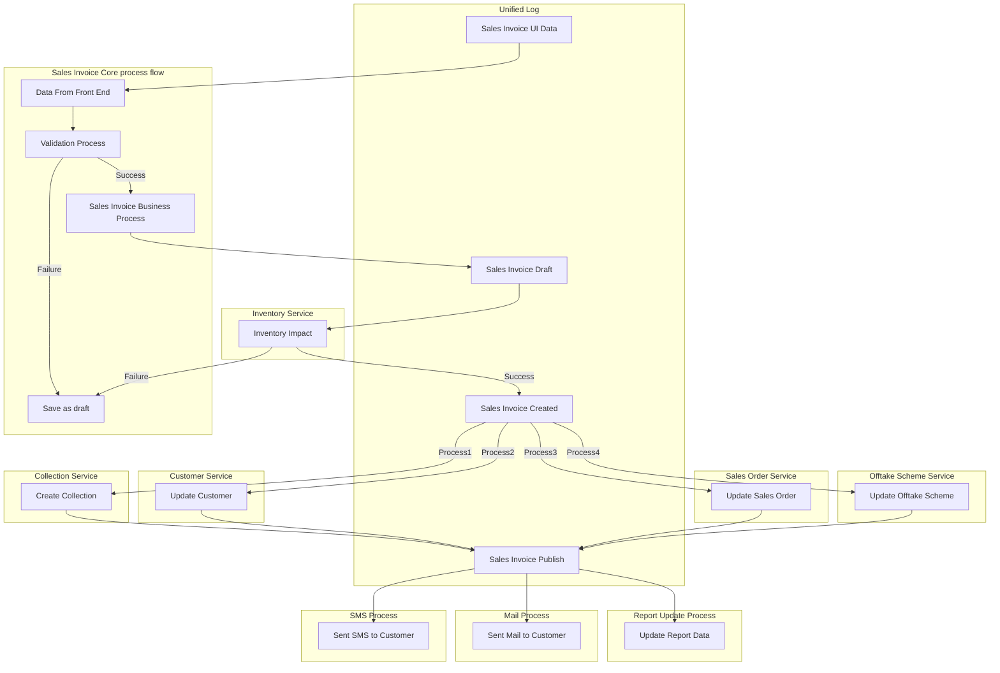

Content
 
[[_TOC_]] 

# Domain Object Sales Invoice `Available for review`
## Data model 

Sales Invoice Document design - Single document with multiple embedded documents for each details & de-normalized master info.  

| Document | Description |
| ---- | ---- |
| forum_sales_invoice | Forum prefix added to the domain object with "_" to represent main document of the domain object |

| Embedded Document of forum_sales_invoice  | Description |
| ---- | ---- |
| forum_sales_invoicecf | Specific Custom fields |
| sales_invoice_product_rel | Product details  | 
| sales_invoice_billads_rel | billing address   | 
| sales_invoice_shipads_rel | shipping address | 

| Embedded Document of sales_invoice_product_rel | Description |
| ---- | ---- |
| sales_Invoice_batch_rel | Sales Invoice batch related details | 
| sales_invoice_scheme_rel | Sales Invoice scheme related details | 
| sales_Invoice_serial_rel | Sales Invoice serial related details  | 
| sales_invoice_tax_rel | Sales Invoice tax related details  | 

## Field wise details ## 

Sales invoice field wise description 

| New Table Name            | New Seq            | New Datatype  | New Attributes                       | MongoDb_Sub_Collection_Name       |
|---------------------------|--------------------|---------------|--------------------------------------|-----------------------------------|
| forum_sales_invoice       | 01r                | int           | salesinvoiceid                       |                                   |
| forum_sales_invoice       | 02_r01             | int           | salesmanid                           |                                   |
| forum_sales_invoice       | denormalized       | varchar(50)   | salesman_name                        | salesman_info                     |
| forum_sales_invoice       | denormalized       | varchar(30)   | salesman_code                        | salesman_info                     |
| forum_sales_invoice       | denormalized       | varchar(30)   | unique_code                          | salesman_info                     |
| forum_sales_invoice       | 02_r02             | int           | beatid                               |                                   |
| forum_sales_invoice       | denormalized       | varchar(100)  | beatname                             | beat_info                         |
| forum_sales_invoice       | denormalized       | varchar(30)   | beatcode                             | beat_info                         |
| forum_sales_invoice       | 02_r03             | int           | buyer_id                             |                                   |
| forum_sales_invoice       | denormalized       | varchar(100)  | customername                         | buyer_info                        |
| forum_sales_invoice       | denormalized       | varchar(30)   | customercode                         | buyer_info                        |
| forum_sales_invoice       | denormalized       | varchar(30)   | unique_retailer_code                 | buyer_info                        |
| forum_sales_invoice       | denormalized       | varchar(30)   | mobile_number                        | buyer_info                        |
| forum_sales_invoice       | 02_r04             | int           | countersales_customerid              |                                   |
| forum_sales_invoice       | denormalized       | varchar(100)  | customername                         | countersales_customer_info        |
| forum_sales_invoice       | denormalized       | varchar(30)   | mobile_number                        | countersales_customer_info        |
| forum_sales_invoice       | 02_r05             | int           | godownid                             |                                   |
| forum_sales_invoice       | denormalized       | varchar(100)  | godown_name                          | godown_info                       |
| forum_sales_invoice       | denormalized       | varchar(100)  | godown_code                          | godown_info                       |
| forum_sales_invoice       | 02_r06             | int           | seller_id                            |                                   |
| forum_sales_invoice       | denormalized       | varchar(30)   | distributor_code                     | distributor_info                  |
| forum_sales_invoice       | denormalized       | varchar(100)  | distributor_name                     | distributor_info                  |
| forum_sales_invoice       | denormalized       | varchar(30)   | phone                                | distributor_info                  |
| forum_sales_invoice       | denormalized       | varchar(30)   | cin_number                           | distributor_info                  |
| forum_sales_invoice       | denormalized       | varchar(30)   | tin_number                           | distributor_info                  |
| forum_sales_invoice       | denormalized       | varchar(30)   | state_reg_number                     | distributor_info                  |
| forum_sales_invoice       | denormalized       | varchar(30)   | central_reg_number                   | distributor_info                  |
| forum_sales_invoice       | denormalized       | varchar(30)   | license_number                       | distributor_info                  |
| forum_sales_invoice       | 02_r07             | int           | buyer_stateid                        |                                   |
| forum_sales_invoice       | denormalized       | varchar(5)    | buyer_statecode                      | buyer_state_info                  |
| forum_sales_invoice       | denormalized       | varchar(50)   | buyer_statename                      | buyer_state_info                  |
| forum_sales_invoice       | 02_r08             | int           | seller_stateid                       |                                   |
| forum_sales_invoice       | denormalized       | varchar(5)    | seller_statecode                     | seller_state_info                 |
| forum_sales_invoice       | denormalized       | varchar(50)   | seller_statename                     | seller_state_info                 |
| forum_sales_invoice       | 02_r13_update      | int           | amend_id                             |                                   |
| forum_sales_invoice       | 02_r15_update      | int           | salesreturnid                        |                                   |
| forum_sales_invoice       | 02_t1              | int/enum      | invoice_type                         |                                   |
| forum_sales_invoice       | denormalized       | int           | key                                  | invoice_type_info                 |
| forum_sales_invoice       | denormalized       | varchar(30)   | value                                | invoice_type_info                 |
| forum_sales_invoice       | 03_e01             | varchar(100)  | transaction_number                   |                                   |
| forum_sales_invoice       | 03_e02             | datetime      | invoice_date                         |                                   |
| forum_sales_invoice       | 03_e03             | varchar(100)  | reference1_manual                    |                                   |
| forum_sales_invoice       | 03_e04             | varchar(100)  | reference2_additional                |                                   |
| forum_sales_invoice       | 03_e05             | varchar(30)   | salesman_cgp_code                    |                                   |
| forum_sales_invoice       | 03_e06             | varchar(150)  | lr_number                            |                                   |
| forum_sales_invoice       | 03_e07             | datetime      | lr_date                              |                                   |
| forum_sales_invoice       | 03_e08             | datetime      | credit_days                          |                                   |
| forum_sales_invoice       | 03_e09             | datetime      | due_date                             |                                   |
| forum_sales_invoice       | 03_e10             | varchar(20)   | cheque_number                        |                                   |
| forum_sales_invoice       | 03_e11             | decimal(25,6) | freight_in                           |                                   |
| forum_sales_invoice       | 03_e12             | varchar(100)  | transporter                          |                                   |
| forum_sales_invoice       | 03_e13             | decimal(25,6) | total_cases                          |                                   |
| forum_sales_invoice       | 03_e14             | decimal(25,6) | total_weight                         |                                   |
| forum_sales_invoice       | 03_e15             | varchar(100)  | eway_bill_number                     |                                   |
| forum_sales_invoice       | 03_e16             | decimal(25,6) | distance                             |                                   |
| forum_sales_invoice       | 03_e17             | varchar(15)   | lr_vehicle_number                    |                                   |
| forum_sales_invoice       | 03_e18             | varchar(10)   | nil_tax_certification                |                                   |
| forum_sales_invoice       | 03_r01             | int           | transaction_series                   |                                   |
| forum_sales_invoice       | denormalized       | varchar(50)   | series_name                          | transaction_series_info           |
| forum_sales_invoice       | denormalized       | varchar(30)   | series_code                          | transaction_series_info           |
| forum_sales_invoice       | 04_e09             | datetime      | payment_date                         |                                   |
| forum_sales_invoice       | 04_e10             | datetime      | duedate                              |                                   |
| forum_sales_invoice       | 04_r11             | int           | payment_mode_id                      |                                   |
| forum_sales_invoice       | denormalized       | int           | key                                  | payment_mode_info                 |
| forum_sales_invoice       | denormalized       | varchar(30)   | value                                | payment_mode_info                 |
| forum_sales_invoice       | 04_r12             | int           | credit_termid                        |                                   |
| forum_sales_invoice       | denormalized       | varchar(100)  | creditterm_description               | credit_term_info                  |
| forum_sales_invoice       | denormalized       | varchar(100)  | creditterm_code                      | credit_term_info                  |
| forum_sales_invoice       | 05_e04             | varchar(30)   | seller_gstin_number                  |                                   |
| forum_sales_invoice       | 05_e05             | varchar(30)   | buyer_gstin_number                   |                                   |
| forum_sales_invoice       | 05_e05             | varchar(50)   | pan_number                           |                                   |
| forum_sales_invoice       | 05_e05             | varchar(50)   | aadhar_number                        |                                   |
| forum_sales_invoice       | 05_t03             | int/enum      | tax_type                             |                                   |
| forum_sales_invoice       | denormalized       | int           | key                                  | tax_type_info                     |
| forum_sales_invoice       | denormalized       | varchar(30)   | value                                | tax_type_info                     |
| forum_sales_invoice       | 06_e01_ag01        | double(25,6)  | invoice_amount                       |                                   |
| forum_sales_invoice       | 06_e02_ag02        | double(25,6)  | itemlevel_amount                     |                                   |
| forum_sales_invoice       | 06_e02_ag06        | double(25,6)  | invoice_roundoff                     |                                   |
| forum_sales_invoice       | 06_e02_ag07        | double(25,6)  | invoicelevel_total_base_qty          |                                   |
| forum_sales_invoice       | 06_e03_update      | double(25,6)  | invoice_outstanding                  |                                   |
| forum_sales_invoice       | 06_e04_ag08_update | double(25,6)  | implicit_collection_amount           |                                   |
| forum_sales_invoice       | 06_r04_update      | int           | implicit_collection_id               |                                   |
| forum_sales_invoice       | denormalized       | datetime      | collection_date                      | collection_info                   |
| forum_sales_invoice       | denormalized       | varchar(30)   | collection_code                      | collection_info                   |
| forum_sales_invoice       | denormalized       | double(25,6)  | collection_amount_received           | collection_info                   |
| forum_sales_invoice       | denormalized       | double(25,6)  | collection_balance                   | collection_info                   |
| forum_sales_invoice       | 07_e01             | double(25,6)  | tcs_percentage                       |                                   |
| forum_sales_invoice       | 07_e01_ag01        | double(25,6)  | tcs_applied_amount                   |                                   |
| forum_sales_invoice       | 07_e01_ag02        | double(25,6)  | tcs_amount                           |                                   |
| forum_sales_invoice       | 08_e01             | double(25,6)  | invoice_discount_percentage          |                                   |
| forum_sales_invoice       | 08_e02             | double(25,6)  | invoicelevel_discount_per_uom_factor |                                   |
| forum_sales_invoice       | 08_e02             | double(25,6)  | invoicelevel_discount_per_uom        |                                   |
| forum_sales_invoice       | 08_e03_ag01        | double(25,6)  | invoice_discount_amount              |                                   |
| forum_sales_invoice       | 09_e01             | text          | invoice_scheme_description           |                                   |
| forum_sales_invoice       | 09_e01_ag01        | double(25,6)  | invoice_scheme_points                |                                   |
| forum_sales_invoice       | 09_e01_ag03        | double(25,6)  | invoice_scheme_discount_percentage   |                                   |
| forum_sales_invoice       | 09_e01_ag04        | double(25,6)  | invoice_scheme_discount_amount       |                                   |
| forum_sales_invoice       | 10_e01             | varchar(200)  | reason                               |                                   |
| forum_sales_invoice       | 10_e02             | text          | terms_conditions                     |                                   |
| forum_sales_invoice       | 11_e01_update      | int           | no_of_amendment                      |                                   |
| forum_sales_invoice       | 11_e02_update      | datetime      | last_print_date                      |                                   |
| forum_sales_invoice       | 11_f01_update      | int/enum      | isStock_updated                      |                                   |
| forum_sales_invoice       | denormalized       | int           | key                                  | isStock_updated_info              |
| forum_sales_invoice       | denormalized       | varchar(30)   | value                                | isStock_updated_info              |
| forum_sales_invoice       | 11_f02_update      | int/enum      | isDelivered                          |                                   |
| forum_sales_invoice       | denormalized       | int           | key                                  | isDelivered_info                  |
| forum_sales_invoice       | denormalized       | varchar(30)   | value                                | isDelivered_info                  |
| forum_sales_invoice       | 11_f03_update      | int/enum      | isfully_returned                     |                                   |
| forum_sales_invoice       | denormalized       | int           | key                                  | isfully_returned_info             |
| forum_sales_invoice       | denormalized       | varchar(30)   | value                                | isfully_returned_info             |
| forum_sales_invoice       | denormalized       | int           | key                                  | tax_discount_config_info          |
| forum_sales_invoice       | denormalized       | varchar(30)   | value                                | tax_discount_config_info          |
| forum_sales_invoice       | 11_f05_update      | int/enum      | is_taxfiled                          |                                   |
| forum_sales_invoice       | denormalized       | int           | key                                  | is_taxfiled_info                  |
| forum_sales_invoice       | denormalized       | varchar(30)   | value                                | is_taxfiled_info                  |
| forum_sales_invoice       | 12_f04             | int/enum      | tax_discount_config                  |                                   |
| forum_sales_invoice       | denormalized       | int           | key                                  | tax_discount_config_info          |
| forum_sales_invoice       | denormalized       | varchar(30)   | value                                | tax_discount_config_info          |
| forum_sales_invoice       | 12_r02             | int           | specialpricesettingid                |                                   |
| forum_sales_invoice       | denormalized       | varchar(30)   | special_price_setting_code           | special_price_setting_info        |
| forum_sales_invoice       | denormalized       | datetime      | effective_from_date                  | special_price_setting_info        |
| forum_sales_invoice       | denormalized       | datetime      | effective_to_date                    | special_price_setting_info        |
| forum_sales_invoice       | state01            | int/enum      | status                               |                                   |
| forum_sales_invoice       | denormalized       | int           | key                                  | status_info                       |
| forum_sales_invoice       | denormalized       | varchar(30)   | value                                | status_info                       |
| forum_sales_invoice       | state02            | int/enum      | next_stage_name                      |                                   |
| forum_sales_invoice       | denormalized       | int           | key                                  | next_stage_name_info              |
| forum_sales_invoice       | denormalized       | varchar(30)   | value                                | next_stage_name_info              |
| forum_sales_invoice       | state03            | datetime      | createdon                            |                                   |
| forum_sales_invoice       | state04            | datetime      | modifiedon                           |                                   |
| forum_sales_invoice       | state05            | int/enum      | isdeleted                            |                                   |
| forum_sales_invoice       | denormalized       | int           | key                                  | deleted_info                      |
| forum_sales_invoice       | denormalized       | varchar(30)   | value                                | deleted_info                      |
| forum_sales_invoice       | state06_r          | int           | createdby                            |                                   |
| forum_sales_invoice       | state07_r          | int           | modifiedby                           |                                   |
| forum_sales_invoice       | state08            | int           | import_sequence_number               |                                   |
| forum_sales_invoice       | state09_r          | int           | owner_id                             |                                   |
| forum_sales_invoice       | state10            | int           | owner_type                           |                                   |
| forum_sales_invoice       | state11            | datetime      | UTC_DateTime_Diff                    |                                   |
| forum_sales_invoice       | state12            | int           | version_number                       |                                   |
| forum_sales_invoice       | state14            | varchar(50)   | record_reference                     |                                   |
| forum_sales_invoicecf     | 02_e05             | varchar(100)  | salesman_product_category_group      |                                   |
| forum_sales_invoicecf     | 02_e06             | varchar(100)  | vehicle_number                       |                                   |
| forum_sales_invoicecf     | 02_e14             | double(25,6)  | shipping_handling_amount             |                                   |
| forum_sales_invoicecf     | 02_e15             | varchar(100)  | referred_by_info                     |                                   |
| forum_sales_invoicecf     | 02_r01             | int           | productgroupid                       |                                   |
| forum_sales_invoicecf     | denormalized       | varchar(100)  | product_group_name                   | product_group_info                |
| forum_sales_invoicecf     | denormalized       | varchar(30)   | product_group_code                   | product_group_info                |
| forum_sales_invoicecf     | 02_r03             | int           | retailer_channel_id                  |                                   |
| forum_sales_invoicecf     | denormalized       | varchar(100)  | retailer_channel_name                | retailer_channel_info             |
| forum_sales_invoicecf     | denormalized       | varchar(100)  | retailer_channel_code                | retailer_channel_info             |
| forum_sales_invoicecf     | 02_r04             | int           | retailer_channel_parent_id           |                                   |
| forum_sales_invoicecf     | denormalized       | varchar(50)   | retailer_channel_parent_name         | retailer_channel_parent_info      |
| forum_sales_invoicecf     | denormalized       | varchar(30)   | retailer_channel_parent_code         | retailer_channel_parent_info      |
| forum_sales_invoicecf     | 03_e01_update      | int           | print_count                          |                                   |
| forum_sales_invoicecf     | 03_f02_update      | int/enum      | is_auto_adjusted                     |                                   |
| forum_sales_invoicecf     | denormalized       | int           | key                                  | is_auto_adjusted_info             |
| forum_sales_invoicecf     | denormalized       | varchar(30)   | value                                | is_auto_adjusted_info             |
| forum_sales_invoicecf     | 04_t01             | int/enum      | tax_form_type                        |                                   |
| forum_sales_invoicecf     | denormalized       | int           | key                                  | tax_form_type_info                |
| forum_sales_invoicecf     | denormalized       | varchar(30)   | value                                | tax_form_type_info                |
| forum_sales_invoicecf     | 05_e01             | double(25,6)  | customer_outstanding                 |                                   |
| forum_sales_invoicecf     | 06_e05             | varchar       | secondary_transaction_number         |                                   |
| forum_sales_invoicecf     | 06_r05             | int           | secondary_transaction_series         |                                   |
| forum_sales_invoicecf     | denormalized       | varchar(50)   | secondary_series_name                | secondary_transaction_series_info |
| forum_sales_invoicecf     | denormalized       | varchar(30)   | secondary_series_code                | secondary_transaction_series_info |
| forum_sales_invoicecf     | 07_e02             | double(25,6)  | currency_conversion_rate             |                                   |
| forum_sales_invoicecf     | 07_r02             | int           | currency_id                          |                                   |
| forum_sales_invoicecf     | denormalized       | varchar(100)  | currency_name                        | currency_info                     |
| forum_sales_invoicecf     | denormalized       | varchar(30)   | currency_code                        | currency_info                     |
| sales_Invoice_batch_rel   | 01r                | int           | id                                   |                                   |
| sales_Invoice_batch_rel   | 01t                | int/enum      | transaction_type                     |                                   |
| sales_Invoice_batch_rel   | denormalized       | int           | key                                  | transaction_type_info             |
| sales_Invoice_batch_rel   | denormalized       | varchar(30)   | value                                | transaction_type_info             |
| sales_Invoice_batch_rel   | 03_e01             | varchar(200)  | batch_no                             |                                   |
| sales_Invoice_batch_rel   | 03_e02             | varchar(200)  | expiry                               |                                   |
| sales_Invoice_batch_rel   | 03_e03             | varchar(200)  | pkd                                  |                                   |
| sales_Invoice_batch_rel   | 04_e05             | double(25,6)  | pts                                  |                                   |
| sales_Invoice_batch_rel   | 04_e06             | decimal(25,6) | net_pts                              |                                   |
| sales_Invoice_batch_rel   | 04_e07             | double(25,6)  | org_pts                              |                                   |
| sales_Invoice_batch_rel   | 04_e08             | double(25,6)  | ptr                                  |                                   |
| sales_Invoice_batch_rel   | 04_e09             | varchar(2000) | ptr_formula                          |                                   |
| sales_Invoice_batch_rel   | 04_e10             | varchar(2000) | ptr_formula_val_str                  |                                   |
| sales_Invoice_batch_rel   | 04_e11             | double(25,6)  | pfm                                  |                                   |
| sales_Invoice_batch_rel   | 04_e12             | double(25,6)  | mrp                                  |                                   |
| sales_Invoice_batch_rel   | 04_e13             | double(25,6)  | ecp                                  |                                   |
| sales_Invoice_batch_rel   | 05_e01             | double(25,6)  | sqty                                 |                                   |
| sales_Invoice_batch_rel   | 05_t01             | int/enum      | sqty_stock_type                      |                                   |
| sales_Invoice_batch_rel   | denormalized       | int           | key                                  | sqty_stock_type_info              |
| sales_Invoice_batch_rel   | denormalized       | varchar(30)   | value                                | sqty_stock_type_info              |
| sales_Invoice_batch_rel   | 06_e02             | double(25,6)  | sfqty                                |                                   |
| sales_Invoice_batch_rel   | 06_t02             | int/enum      | sfqty_stock_type                     |                                   |
| sales_Invoice_batch_rel   | denormalized       | int           | key                                  | sfqty_stock_type_info             |
| sales_Invoice_batch_rel   | denormalized       | varchar(30)   | value                                | sfqty_stock_type_info             |
| sales_Invoice_batch_rel   | 07_e03             | double(25,6)  | dqty                                 |                                   |
| sales_Invoice_batch_rel   | 07_t03             | int/enum      | dqty_stock_type                      |                                   |
| sales_Invoice_batch_rel   | denormalized       | int           | key                                  | dqty_stock_type_info              |
| sales_Invoice_batch_rel   | denormalized       | varchar(30)   | value                                | dqty_stock_type_info              |
| sales_Invoice_batch_rel   | 08_e04             | double(25,6)  | dfqty                                |                                   |
| sales_Invoice_batch_rel   | 08_t04             | int/enum      | dfqty_stock_type                     |                                   |
| sales_Invoice_batch_rel   | denormalized       | int           | key                                  | dfqty_stock_type_info             |
| sales_Invoice_batch_rel   | denormalized       | varchar(30)   | value                                | dfqty_stock_type_info             |
| sales_Invoice_batch_rel   | 09_t01             | int/enum      | track_serial                         |                                   |
| sales_Invoice_batch_rel   | denormalized       | int           | key                                  | track_serial_info                 |
| sales_Invoice_batch_rel   | denormalized       | varchar(30)   | value                                | track_serial_info                 |
| sales_Invoice_batch_rel   | 09_t02             | int/enum      | ptr_type                             |                                   |
| sales_Invoice_batch_rel   | denormalized       | int           | key                                  | ptr_type_info                     |
| sales_Invoice_batch_rel   | denormalized       | varchar(30)   | value                                | ptr_type_info                     |
| sales_invoice_billads_rel | 02_e01             | varchar(250)  | bill_address1                        |                                   |
| sales_invoice_billads_rel | 02_e02             | varchar(100)  | bill_address2                        |                                   |
| sales_invoice_billads_rel | 02_e03             | varchar(100)  | bill_city                            |                                   |
| sales_invoice_billads_rel | 02_e04             | varchar(100)  | bill_state                           |                                   |
| sales_invoice_billads_rel | 02_e05             | varchar(100)  | bill_country                         |                                   |
| sales_invoice_billads_rel | 02_r01             | int           | retailer_billads_id                  |                                   |
| sales_invoice_product_rel | 01r                | int           | id                                   |                                   |
| sales_invoice_product_rel | 02_e00             | int           | sequence_no                          |                                   |
| sales_invoice_product_rel | 02_e02             | varchar(250)  | comment                              |                                   |
| sales_invoice_product_rel | 02_r01             | int           | salesinvoiceid                       |                                   |
| sales_invoice_product_rel | 02_r02             | int           | productid                            |                                   |
| sales_invoice_product_rel | denormalized       | varchar(100)  | product_name                         | product_info                      |
| sales_invoice_product_rel | denormalized       | varchar(50)   | product_code                         | product_info                      |
| sales_invoice_product_rel | 02_r02_ref         | varchar(30)   | productcode                          |                                   |
| sales_invoice_product_rel | 02_r03             | int           | quotationid                          |                                   |
| sales_invoice_product_rel | denormalized       | varchar(100)  | quotation_name                       | quotation_info                    |
| sales_invoice_product_rel | denormalized       | varchar(30)   | quotation_code                       | quotation_info                    |
| sales_invoice_product_rel | 02_t01             | int/enum      | product_type                         |                                   |
| sales_invoice_product_rel | denormalized       | int           | key                                  | product_type_info                 |
| sales_invoice_product_rel | denormalized       | varchar(30)   | value                                | product_type_info                 |
| sales_invoice_product_rel | 03_e01             | decimal(25,6) | quantity                             |                                   |
| sales_invoice_product_rel | 03_r01             | int           | tuom                                 |                                   |
| sales_invoice_product_rel | denormalized       | varchar(100)  | uom_name                             | uom_info                          |
| sales_invoice_product_rel | denormalized       | varchar(100)  | uom_code                             | uom_info                          |
| sales_invoice_product_rel | 04_e01_ag          | decimal(25,6) | baseqty                              |                                   |
| sales_invoice_product_rel | 04_t01             | int/enum      | baseqty_stock_type                   |                                   |
| sales_invoice_product_rel | denormalized       | int           | key                                  | baseqty_stock_type_info           |
| sales_invoice_product_rel | denormalized       | varchar(30)   | value                                | baseqty_stock_type_info           |
| sales_invoice_product_rel | 05_e02             | decimal(25,6) | dam_qty                              |                                   |
| sales_invoice_product_rel | 05_t02             | int/enum      | dam_qty_stock_type                   |                                   |
| sales_invoice_product_rel | denormalized       | int           | key                                  | dam_qty_stock_type_info           |
| sales_invoice_product_rel | denormalized       | varchar(30)   | value                                | dam_qty_stock_type_info           |
| sales_invoice_product_rel | 05_t03             | int/enum      | dam_free_qty_stock_type              |                                   |
| sales_invoice_product_rel | denormalized       | int           | key                                  | dam_free_qty_stock_type_info      |
| sales_invoice_product_rel | denormalized       | varchar(30)   | value                                | dam_free_qty_stock_type_info      |
| sales_invoice_product_rel | 06_e02             | decimal(25,6) | free_qty                             |                                   |
| sales_invoice_product_rel | 06_t02             | int/enum      | free_qty_stock_type                  |                                   |
| sales_invoice_product_rel | denormalized       | int           | key                                  | free_qty_stock_type_info          |
| sales_invoice_product_rel | denormalized       | varchar(30)   | value                                | free_qty_stock_type_info          |
| sales_invoice_product_rel | 07_e01             | int/enum      | billing_at                           |                                   |
| sales_invoice_product_rel | denormalized       | int           | key                                  | billing_at_info                   |
| sales_invoice_product_rel | denormalized       | varchar(30)   | value                                | billing_at_info                   |
| sales_invoice_product_rel | 07_e02             | double(25,6)  | listprice                            |                                   |
| sales_invoice_product_rel | 07_e03             | double(25,6)  | net_price                            |                                   |
| sales_invoice_product_rel | 07_e04             | double(25,6)  | net_ptr                              |                                   |
| sales_invoice_product_rel | 08_e01             | double(25,6)  | discount_percent                     |                                   |
| sales_invoice_product_rel | 08_e02             | double(25,6)  | discount_per_uom                     |                                   |
| sales_invoice_product_rel | 08_e02_ag01        | double(25,6)  | uom_discount_factor                  |                                   |
| sales_invoice_product_rel | 08_e03_ag01        | double(25,6)  | discount_amount                      |                                   |
| sales_invoice_product_rel | 08_e04_ag02        | double(25,6)  | invoice_level_discount               |                                   |
| sales_invoice_product_rel | 08_e05_ag02        | double(25,6)  | sch_disc_amount                      |                                   |
| sales_invoice_product_rel | 08_e06_ag02        | double(25,6)  | total_after_discount                 |                                   |
| sales_invoice_product_rel | 08_e07_ag01        | double(25,6)  | total_tax_amount                     |                                   |
| sales_invoice_product_rel | 09_e01_ref         | double(25,6)  | ref_baseqty                          |                                   |
| sales_invoice_product_rel | 09_e02_update      | double(25,6)  | return_baseqty                       |                                   |
| sales_invoice_product_rel | 09_r01_ref         | int           | salesorder_ref                       |                                   |
|                           |                    |               | salesorderid                         |                                   |
|                           |                    |               | salesorder_line_id                   |                                   |
| sales_invoice_product_rel | 09_r01_ref         | int           | dispatch_ref                         |                                   |
|                           |                    |               | dispatchid                           |                                   |
|                           |                    |               | dispatch_line_id                     |                                   |
| sales_invoice_product_rel | ag15               | double(25,6)  | tax2_amount                          |                                   |
| sales_invoice_product_rel | ag16               | double(25,6)  | tax3_amount                          |                                   |
| sales_invoice_scheme_rel  | 02_e00             | int           | sequence_no                          |                                   |
| sales_invoice_scheme_rel  | 03_e01             | varchar(200)  | scheme_name                          |                                   |
| sales_invoice_scheme_rel  | 03_r01             | int           | scheme_id                            |                                   |
| sales_invoice_scheme_rel  | denormalized       | varchar(100)  | scheme_code                          | scheme_info                       |
| sales_invoice_scheme_rel  | denormalized       | varchar(100)  | scheme_description                   | scheme_info                       |
| sales_invoice_scheme_rel  | 04_e02             | varchar(200)  | scheme_applied                       |                                   |
| sales_invoice_scheme_rel  | 04_e03             | double(25,6)  | value                                |                                   |
| sales_invoice_scheme_rel  | 04_e04             | double(25,6)  | pricevalue                           |                                   |
| sales_invoice_scheme_rel  | 04_e05             | double(25,6)  | disc_qty                             |                                   |
| sales_invoice_scheme_rel  | 04_e06             | int/enum      | disc_every                           |                                   |
| sales_invoice_scheme_rel  | denormalized       | int           | key                                  | disc_every_info                   |
| sales_invoice_scheme_rel  | denormalized       | varchar(30)   | value                                | disc_every_info                   |
| sales_invoice_scheme_rel  | 04_e07             | double(25,6)  | disc_amount                          |                                   |
| sales_Invoice_serial_rel  | 02_e00             | int           | sequence_no                          |                                   |
| sales_Invoice_serial_rel  | 02_t01             | char(5)       | transaction_type                     |                                   |
| sales_Invoice_serial_info | 02_t02             | char(5)       | stock_type                           |                                   |
| sales_Invoice_serial_rel  | 02_t03             | int/enum      | substock_type                        |                                   |
| sales_Invoice_serial_rel  | denormalized       | int           | key                                  | substock_type_info                |
| sales_Invoice_serial_rel  | denormalized       | varchar(30)   | value                                | substock_type_info                |
| sales_Invoice_serial_rel  | 03_e01             | varchar(50)   | serialnumber                         |                                   |
| sales_Invoice_serial_rel  | 03_e02             | varchar(50)   | return_serialnumber                  |                                   |
| sales_invoice_shipads_rel | 02_e01             | varchar(250)  | ship_address1                        |                                   |
| sales_invoice_shipads_rel | 02_e02             | varchar(100)  | ship_address2                        |                                   |
| sales_invoice_shipads_rel | 02_e03             | varchar(100)  | ship_city                            |                                   |
| sales_invoice_shipads_rel | 02_e04             | varchar(100)  | ship_state                           |                                   |
| sales_invoice_shipads_rel | 02_e05             | varchar(100)  | ship_country                         |                                   |
| sales_invoice_shipads_rel | 02_e06             | varchar(30)   | gstin_number                         |                                   |
| sales_invoice_shipads_rel | 02_r01             | int           | retailer_shipads_id                  |                                   |
| sales_invoice_tax_rel     | 02_e00             | int           | sequence_no                          |                                   |
| sales_invoice_tax_rel     | 03_e01             | varchar(200)  | tax_label                            |                                   |
| sales_invoice_tax_rel     | 03_e02             | double(25,6)  | tax_display_percentage               |                                   |
| sales_invoice_tax_rel     | 03_e03             | double(25,6)  | tax_percentage                       |                                   |
| sales_invoice_tax_rel     | 03_e04             | double(25,6)  | tax_amt                              |                                   |
| sales_invoice_tax_rel     | 03_e05             | double(25,6)  | taxable_amt                          |                                   |
| sales_invoice_tax_rel     | 03_r01             | int           | taxid                                |                                   |
| sales_invoice_tax_rel     | denormalized       | varchar(100)  | tax_description                      | tax_info                          |
| sales_invoice_tax_rel     | denormalized       | varchar(100)  | tax_code                             | tax_info                          |
| sales_invoice_tax_rel     | 03_t01             | varchar(200)  | tax_type                             |                                   |
| sales_invoice_tax_rel     | 03_t02             | int/enum      | tax_on_uom_flag                      |                                   |
| sales_invoice_tax_rel     | denormalized       | int           | key                                  | tax_on_uom_flag_info              |
| sales_invoice_tax_rel     | denormalized       | varchar(30)   | value                                | tax_on_uom_flag_info              |
| sales_invoice_tax_rel     | 03_t03             | int/enum      | tax_group_type                       |                                   |
| sales_invoice_tax_rel     | denormalized       | int           | key                                  | tax_group_type_info               |
| sales_invoice_tax_rel     | denormalized       | varchar(30)   | value                                | tax_group_type_info               |

 <!-- blank line -->
# [To create a Sales Invoice](Sales Invoice Creation)  
> Sales Invoice creation, types of sales invoice, calculations, scheme, tax sections are covered in Sales Invoice creation page & reference provided here. 
 <!-- blank line -->
## [Sales Invoice Calculation](Sales Invoice Creation#rate-calculation) 
 <!-- blank line -->
## [Sales Invoice Scheme](Sales Invoice Creation#scheme)
 <!-- blank line -->
## [Sales Invoice Tax](Sales Invoice Creation#tax)

 <!-- blank line -->
## [Sales Invoice Configuration](Sales Invoice Configurations) 
> Sales Invoice configurations are maintained in separate page, only reference provided [here](Sales Invoice Configuration). 

 <!-- blank line -->
## Events at Front End
  - Sales Invoice list view page 
    - Listing Sales Invoice
  - While Creating Sales Invoice 
    - Render page based on user profile (To be explained in separate page) 
    - Listing Salesman
    - On Selection of Salesman, Retrieve Salesman Category info, Filter related Beat, Filter related customer.
    - Listing Beat 
    - On Selection of Beat, Retrieve relevant Customer, Salesman if not selected.  
    - Listing Customer
    - On Selection of Customer, retrieve relevant Beat, Salesman, Customer outstanding, Customer Info, Customer address
    - Listing Transaction Series for Sales Invoice
    - Listing Godown of Distributor 
    - Listing Product
    - On Selection of Product, retrieve relate product info, Batch details, Tax info, Scheme info, current stock position.
    - List Batch info of the product
    - List relevant Adjustment info 
 

 <!-- blank line -->
## Events at Business logic layer (overview)
- Apply Dynamic front end access control based on user profile. 
- Generate record reference number for transaction internal reference. Every request should have this reference to process, manipulate or produce data. 

- Validate the data submitted from front end - Datatype & security related. 
- Validate the data submitted from front end - Business related. 

**Business Flow Validations**

  - User chooses the 'Sales Invoice Entry' menu item. 
  - System should pick the Default Distributor details 
  - User selects the Beat name or code
  - User selects the customers which should get load based on the previous event of selected beat 
  - System should pick the Billing Address and shipping address of the selected customer 
  - System should check the Customer-salesman-product-pricing group and retrieve these items as qualified items for creating an invoice
  - System should also check the list of schemes available for the qualified items and  apply it while creating an Invoice 
  - System should check for configuration to apply or not to apply scheme on the invoice 
  - User enters the product id/product name and desired quantity in respective fields.
  - User clicks on [Add item] button to add the next item.
  - System adds the desired product in draft mode 
  - User applies the Promotion/Coupon code if available.
  - Being continued,user clicks on 'Save' Invoice link.
  - User adds/updates shipping information.
  - User selects the shipping method for the Invoice.
  - User can enters Credit term type description.
  - System will create Sales Invoice and update the total amount as Due for collection
  - User can select the payment methods as Cash or Cheque and do the required collection
  - User clicks on 'Sales Invoice' link and Sales Invoice will be created in 'Created/Publish' status.
  - User can select the 'Sales invoice' and print the 'Tax Invoice'

- Apply pricing 
  - Price for specific customer channel & product are to be arrived and applied. 

- Apply Tax 
  - Apply Tax as per the tax definition applicable for the distributor, customer, product criteria, tax identification availability.  

- Apply scheme 
  - Apply scheme as per the scheme definition for the customer criteria, applicable distributor and product. 
  - Apply Offtake scheme benefit as applicable for the customer. 

- Apply stock impact related validation 
  - Check validation criteria on availability of stock  

- Apply Transaction series
   - Pick the Auto incremental sequencing codification and Apply for the Transaction series 

- Ap ply Transaction series with Order Reference
   - Pick the Sales Order reference and Apply the same against the respective Sales Invoice 

- Apply implicit collection and adjustment related validation.
  - Check all validations & precondition as per [Collection](Collection Creation)

- Apply business workflow logic.
  - As per configuration, apply business logic based workflow for the respective modules.
 
- Apply Log 
  - Generate access log for application. 

 <!-- blank line -->
## Events at Unified Log
### Flow of related Events  

- Sales Invoice Service scope limited to Sales invoice creation/amendment/cancel/delete. 
- Sales Invoice Service to trigger the related sub services which are internal and separate service. 

 <!-- blank line -->
- Inventory management of reducing / increase in stock during Sales invoice operations are separated as internal service. 
- Customer outstanding to get updated in Customer ledger. 
- Implicit collection to be Created and outstanding will get adjusted. 
- Discounts and Scheme Discounts to be updated and tracked for claim.  
- Sales Order to be updated for Sales Order closure status depending on number of quantity filled. 
- Offtake scheme benefit to be updated depending on applied benefit in Sales invoice. 
- printing of data to be prepared for Dispatch / Delivery process. 

 <!-- blank line -->
- Mail triggers to Customer 
- SMS triggers to Customer
- Report related Sales data to be updated through services. 

### Flow of related Events Chart

# See also .... 
- [Domain Objects](Domain Objects)
- [Sales](Sales) 
- [Sales Invoice](Sales Invoice)
- [Sales Invoice Creation](Sales Invoice Creation)
- [Business Functionality](Business Functionality)
- [Home](Home)
